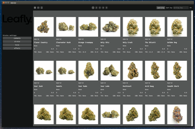

# IQT Framework

Welcome to the IQT Framework, a fresh way to make GUIs in Python. We know that using QT often means writing a lot of the same code over and over for each part of your app. It can get pretty overwhelming with all the settings you need to tweak. So we're building IQT to make things way easier.

With IQT, you can put together the visual parts of your app fast, with just a few lines of code. It lets you stay focused on what your app should do, not on the repetitive setup stuff. This means you get to the fun part of making your app work the way you want it to, quicker.

Keep an eye out for updates as we keep building and improving IQT.
## Simple example

Below is a sample code snippet to illustrate the simplicity of creating a login interface with IQT:

So you need only 60+ lines of code to make app like this
<p align="center">
  
</p>


```python
from iqt.app import Application
from iqt.window import Window
from iqt.components.widgets import Widget, Input, CheckBox
from iqt.components.layouts import Horizont, Vertical
from iqt.components import Button, Label, Image


class BaseResponseWidget(Widget):
    to_connect = {"back_to_login": ["button.clicked"]}

    def back_to_login(self):
        self.window.change_widget(LoginWidget())


class LoginValidWidget(BaseResponseWidget, size=(360, 240)):
    items = Vertical[
        Horizont[..., Label("SUPER SECRET CONTENT HERE"), ...],
        Button("logout")
    ]


class LoginInvalidWidget(BaseResponseWidget, size=(240, 80)):
    items = Vertical[Label("login:valid_pwd"), Button("try again")]


class LoginWidget(
    Widget,
    name="main_widget",
    size=(280, 360),
    margins=(16, 8, 16, 8),
):
    items = Vertical[
        Horizont[..., Image("logo.png", fixed_width=160)],
        Horizont[Label("Please Login:")],
        Horizont[Label("login:"), ..., Input("login", fixed_width=160)],
        Horizont[Label("pass:"), ..., Input("pwd", fixed_width=160)],
        Horizont[CheckBox("Remember me"), ..., Button("login")],
    ]

    def items_handler(self, sender: Widget, *args, **kwargs):
        match sender.name:
            case "button":
                if self.login.text() in ["biba", "boba"]:
                    self.window.change_widget(LoginValidWidget())
                else:
                    self.window.change_widget(LoginInvalidWidget())
            case "checkbox":
                print("change config state")


class LoginWindow(
    Window,
    name="login_window",
    transparent=False,
    title="Please login",
    widget_model=LoginWidget,
):
    ...


class TestGUI(Application, start_window=LoginWindow):
    ...


if __name__ == '__main__':
    TestGUI().run()
```


## Introducing Data View
Iam excited to share a sneak peek at a new feature coming to the IQT Framework: Data View. This addition is all about making it easier for you to create GUIs by simply defining your data model. Here's what you can look forward to:

What's New with Data View:
- pagination
- filtration
- sorting
- 3 type of view

<p align="center">
  
</p>

Simplify Your Code: Just define your data model, and Data View handles the rest, generating the interface automatically.
More Control and Flexibility: In the pipeline are features for object manipulation, such as selecting and bulk editing, tailored specifically to the type of data you're working with. Plus, each data type will get its widget, potentially even with auto-generation for ease of use.
Customization and Adaptability: Data View is built to be flexible, letting you display and manage data in various layouts. You'll have the foundation to create views that not only look great but also fit exactly what your app needs.
Aligned with IQT Framework's Vision: True to the IQT Framework's aim, Data View is here to make GUI development in Python faster and more intuitive, providing you with components that are easy to use and configure. It's all about enhancing your app's data display and interaction, fitting a wide range of application requirements.
Stay tuned for more updates as we continue to develop and enhance the Data View feature!

