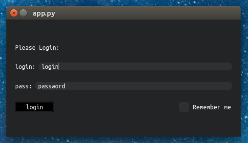

# IQT Framework

Welcome to the IQT Framework, a fresh way to make GUIs in Python. We know that using QT often means writing a lot of the same code over and over for each part of your app. It can get pretty overwhelming with all the settings you need to tweak. So we're building IQT to make things way easier.

With IQT, you can put together the visual parts of your app fast, with just a few lines of code. It lets you stay focused on what your app should do, not on the repetitive setup stuff. This means you get to the fun part of making your app work the way you want it to, quicker.

Keep an eye out for updates as we keep building and improving IQT.
## Simple example

Below is a sample code snippet to illustrate the simplicity of creating a login interface with IQT:



```python
from iqt.app import Application
from iqt.window import Window
from iqt.components.widgets import Widget, BaseInput as Input, BaseCheckBox as CheckBox
from iqt.components.layouts import Horizont, Vertical
from iqt.components import Label, Button


class LoginWidget(
    Widget,
    name="main_widget",
    layout=Vertical[
        ...,
        Horizont[Label("Please Login:")],
        Horizont[Label("login:"), Input("login")],
        Horizont[Label("pass:"), Input("password")],
        Horizont[Button("login"), ..., CheckBox("Remember me")],
        ...,
    ],
):
    def items_handler(self, sender: Widget, *args, **kwargs):
        match sender.name:
            case "button":
                ...  # do login
            case "checkbox":
                ...  # change config state


class LoginWindow(
    Window,
    fixed_size=(480, 240),
    transparent=False,
    title="Please login",
    widget_model=LoginWidget,
):
    ...


class TestGUI(Application, window_model=LoginWindow):
    ...


if __name__ == '__main__':
    TestGUI().run()
```
