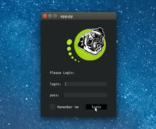

# IQT Framework

Welcome to the IQT Framework, a fresh way to make GUIs in Python. We know that using QT often means writing a lot of the same code over and over for each part of your app. It can get pretty overwhelming with all the settings you need to tweak. So we're building IQT to make things way easier.

With IQT, you can put together the visual parts of your app fast, with just a few lines of code. It lets you stay focused on what your app should do, not on the repetitive setup stuff. This means you get to the fun part of making your app work the way you want it to, quicker.

Keep an eye out for updates as we keep building and improving IQT.

Python 3.11 required
## Simple example

To run this example, clone the repository and execute ```make run``` in the root directory.

Below is a sample code snippet to illustrate the simplicity of creating a login interface with IQT:

So you need only 60+ lines of code to make app like this.
<p align="center">
  
</p>


```python
from iqt.app import Application
from iqt.window import Window
from iqt.components.widgets import Widget, Input, CheckBox
from iqt.components.layouts import Horizont, Vertical
from iqt.components import Button, Label, Title, Image
from iqt.components.data_view.dynamic import DynamicDataView
from dataset import Supply, Supplies

class StrainsView(DynamicDataView):
    item_model = Supply()
    dataset = Supplies

class LoginInvalidWidget(Widget, size=(240, 80), margins=(16, 8, 16, 8)):
    items = Vertical[Label("login is biba or boba"), Button("try again")]
    to_connect = {"back_to_login": ["button.clicked"]}

    def back_to_login(self, *args, **kwargs):
        self.window.change_widget(LoginWidget())

class LoginWidget(Widget, size=(280, 360), margins=(16, 8, 16, 8)):
    items = Vertical[
        Horizont[..., Image("logo.png", fixed_width=160)],
        Horizont[Title("Please Login:")],
        Horizont[Label("login:"), ..., Input("login", fixed_size=(160, 32))],
        Horizont[Label("pass:"), ..., Input("pwd", fixed_size=(160, 32))],
        Horizont[CheckBox("Remember me"), ..., Button("login")],
    ]

    def items_handler(self, sender: Widget, *args, **kwargs):
        match sender.name:
            case "button":
                if self.login.text() in ["biba", "boba"]:
                    self.window.change_widget(StrainsView(size=(1600, 1024)))
                else:
                    self.window.change_widget(LoginInvalidWidget())
            case "checkbox":
                print("change config state")

class TestGUI(Application):
    class StartWindow(Window, title="Please login", widget_model=LoginWidget):
        ...

if __name__ == '__main__':
    TestGUI().run()
```
This interface retrieves data from a simple storage. It is a class that contains a dictionary named items, in which lie homogeneous Pydantic models. 

The content of the file dataset.py is sufficient for an interface to be automatically generated with three view types, filtering, pagination, and sorting.
```python
from iqt.components.data_view.item import BaseDataItem
from iqt.components.data_view.dataset import Dataset

class Supply(BaseDataItem):
    _view_widgets: dict = {}
    _sort_fields: str = ["name", "rating", "category"]

    id: int = Field(None, description="ID")
    rating: float = Field(None, description="Rating")
    category: Literal["books", "other"] = Field(None, description="Category")
    name: str = Field(None, description="Name")
    image: str = Field(None, description="<preview>")
    slug: str | None = Field(None, description="Slug")
    subtitle: str = Field(None, description="<item_name>")
    discount: bool = Field(False, description="Discount")

class Supplies(Dataset):
    dump_file: Path = Path("supplies.pickle")
    item_model: BaseModel = Supply()
```

Features to be added:
- Functions for convenient editing will be added
- Widget caching.

Stay tuned for updates.
